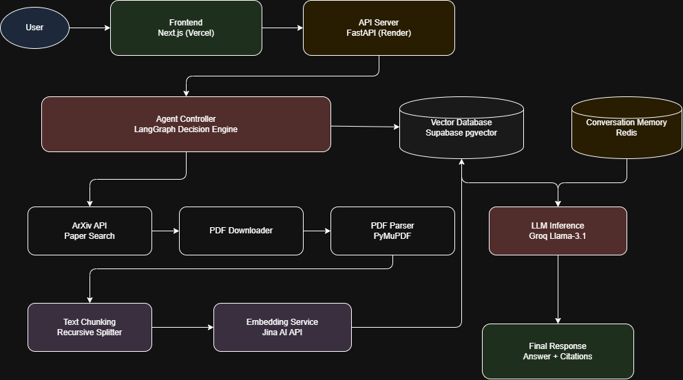

# 🤖 AI Research Copilot — Agentic RAG Research Assistant

[](https://agentic-rag-research-assistant-lb5yixibp.vercel.app/)
[](https://agentic-rag-backend-jy8a.onrender.com/)

> An autonomous AI research assistant that dynamically retrieves knowledge from a vector database or performs real-time research by downloading and processing ArXiv papers.

Built using **LangGraph agent workflows**, **Supabase pgvector**, **Groq Llama-3.1**, and **Jina embeddings**.

---

# 🎯 Project Overview

AI Research Copilot is a **production-grade Agentic Retrieval-Augmented Generation (RAG) system**.

Unlike traditional RAG pipelines that only query a static vector database, this system **autonomously decides when it needs to expand its knowledge** by downloading new research papers from ArXiv and adding them to its knowledge base.

This allows the assistant to **continuously grow its research knowledge during conversations.**

---

# 🔑 Core Features

✅ **Agentic AI Workflow** powered by LangGraph  
✅ **Dynamic Knowledge Expansion** through ArXiv ingestion  
✅ **Persistent Vector Database** using Supabase pgvector  
✅ **Fast LLM Inference** with Groq Llama-3.1  
✅ **Batch Embedding Pipeline** using Jina AI  
✅ **Conversational Memory** using Redis  
✅ **Real-time Research Retrieval**  
✅ **Production Deployment** on Render + Vercel

---

# 🏗 System Architecture



---

# 💻 Tech Stack

## Backend

| Technology        | Purpose                           |
| ----------------- | --------------------------------- |
| FastAPI           | High-performance Python API       |
| LangGraph         | Agent workflow orchestration      |
| LangChain         | LLM abstraction + prompt handling |
| Supabase pgvector | Persistent vector database        |
| Groq Cloud        | Llama-3.1 inference               |
| Jina AI           | High-speed embeddings API         |
| PyMuPDF           | PDF text extraction               |
| Redis             | Conversation memory persistence   |
| ArXiv API         | Research paper retrieval          |

---

## Frontend

| Technology  | Purpose            |
| ----------- | ------------------ |
| Next.js     | React framework    |
| TypeScript  | Type-safe frontend |
| TailwindCSS | UI styling         |
| Vercel      | Frontend hosting   |

---

## DevOps

| Tool     | Purpose                 |
| -------- | ----------------------- |
| Render   | Backend deployment      |
| Vercel   | Frontend deployment     |
| GitHub   | Version control         |
| Supabase | Vector database hosting |

---

# 🚀 Deployment Architecture

```

User
↓
Vercel (Next.js Frontend)
↓
Render (FastAPI Backend)
↓
LangGraph Agent
↓
Supabase pgvector
↓
Jina Embedding API
↓
Groq Llama-3.1

```

---

# 🌐 Live Deployment

Frontend  
https://agentic-rag-research-assistant-lb5yixibp.vercel.app

Backend API  
https://agentic-rag-backend-jy8a.onrender.com

---

# 🧠 Key Technical Highlights

## 1️⃣ Agentic Decision Engine

The system uses **LangGraph's state machine** to determine whether existing knowledge is sufficient or new research must be performed.

```

retrieve_and_check
↓
decision
├─ generate_answer
└─ do_research

```

If the context retrieved from the vector database is insufficient, the agent automatically triggers the research pipeline.

---

# 2️⃣ Research Paper Ingestion Pipeline

When the system detects missing knowledge:

1️⃣ Search ArXiv  
2️⃣ Download PDF  
3️⃣ Extract text using PyMuPDF  
4️⃣ Split text into semantic chunks  
5️⃣ Generate embeddings using Jina API  
6️⃣ Store vectors in Supabase pgvector  
7️⃣ Retrieve relevant chunks for answer generation

---

# 3️⃣ Optimized Embedding Pipeline

The system uses **batch embeddings** to dramatically reduce latency.

Instead of:

```

100 chunks → 100 API calls

```

It performs:

```

100 chunks → ~3 batch calls

```

Benefits:

- significantly faster ingestion
- reduced API calls
- lower embedding latency

---

# 4️⃣ Persistent Vector Database

Vectors are stored in **Supabase pgvector**, enabling:

• persistent storage  
• scalable vector search  
• SQL-based similarity queries

Example vector similarity function:

```

match_documents(query_embedding vector, match_count int)

```

---

# 💬 Conversational Memory

User conversations are stored in **Redis**.

This enables:

• multi-turn conversation context  
• follow-up questions  
• scalable memory for multiple users

---

# 📊 Performance Metrics

| Metric          | Value      |
| --------------- | ---------- |
| LLM inference   | ~400-600ms |
| Vector search   | ~50-100ms  |
| Paper ingestion | ~3-8s      |
| Cold start      | ~2s        |

---

# 📁 Repository Structure

```

Agentic_RAG/
│
├── backend/
│   ├── main.py
│   ├── agent.py
│   ├── ingest.py
│   ├── requirements.txt
│   └── runtime.txt
│
├── frontend/
│   ├── app/
│   ├── components/
│   ├── next.config.ts
│   └── package.json
│
├── system_architecture.png
├── README.md
└── .gitignore

```

---

# 🔐 Environment Configuration

## Backend (.env)

```

GROQ_API_KEY=
JINA_API_KEY=
SUPABASE_URL=
SUPABASE_KEY=
REDIS_URL=

```

---

## Frontend (.env.local)

```

NEXT_PUBLIC_BACKEND_URL=

```

---

# 🌟 Future Improvements

Planned upgrades:

- Streaming responses (Server-Sent Events)
- Multi-source research ingestion
- Semantic caching layer
- Knowledge deduplication
- Paper summarization
- Authentication (Clerk / Auth0)
- Query analytics dashboard

---

# 👤 Author

**Harshal Sharma**

AI / ML Engineer | Full-Stack AI Systems

GitHub  
https://github.com/Harshalsharma05

LinkedIn  
https://www.linkedin.com/in/harshal-sharma-98851b2ab

---

# 🙏 Acknowledgements

Groq  
LangChain  
LangGraph  
Supabase  
Jina AI  
ArXiv

---

⭐ If you find this project interesting, consider giving the repository a star.
