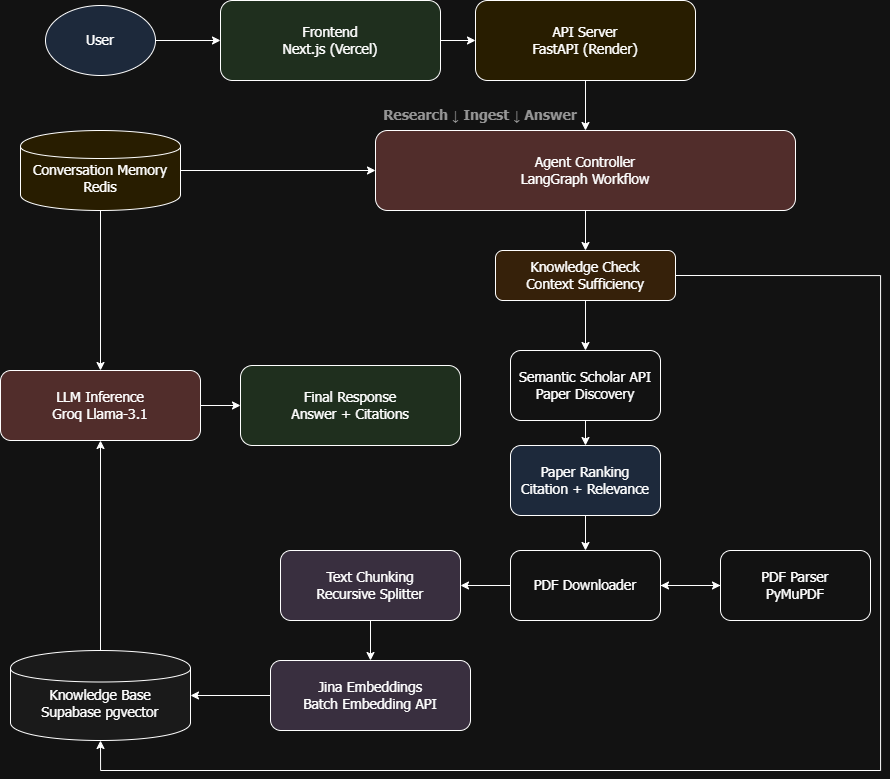

<div align="center">
	

  <h1>Syntropy — Agentic RAG Research Assistant</h1>

</div>

[](https://agentic-rag-research-assistant.vercel.app/)
[](https://agentic-rag-backend-jy8a.onrender.com/)

> A retrieval augmented search assistant featuring dynamic data ingestion. It supplements a standard vector database by automatically scraping, chunking, and embedding missing academic research via Semantic Scholar during active conversations.

Built with LangGraph, Supabase pgvector, Groq, Gemini 2.5 Flash, and Jina AI.

---

# Project Overview

Syntropy is a dynamic **Retrieval-Augmented Generation (RAG)** system designed to overcome the limitations of static vector databases. 

Rather than relying on pre populated knowledge, the system programmatically evaluates context sufficiency. 

If existing data is inadequate, it triggers an **automated ingestion pipeline** that queries the Semantic Scholar API to fetch, process, and index new academic papers in real time, allowing the database to scale organically based on user queries.

---

# Core Features

- **Multi-LLM Cognitive Routing:** Uses Groq (Llama-3.1-8b) for sub-second task classification and Gemini 2.5 Flash for complex document synthesis.

- **Concurrency & State Management:** Uses database-enforced unique constraints and background polling to prevent race conditions during parallel processing.

- **Advanced Retrieval Architecture:** Implements a Parent-Child hierarchical tree and Two-Stage Semantic Chunking to reduce context dilution.

- **Hybrid Search & Cross-Encoder Reranking:** Combines PostgreSQL BM25 sparse search with dense vectors via Reciprocal Rank Fusion (RRF), refined by Jina Reranker.

---

# System Architecture & Tech Stack
Syntropy is built on a modular, multi-tier architecture prioritizing low-latency inference, dynamic data ingestion, and scalable vector retrieval. 

<div align="center">
	
</div>


---

| Architecture Layer | Technology | Engineering Purpose |
| :--- | :--- | :--- |
| **Cognition & Orchestration** | **LangGraph & LangChain** | State machine routing, tool calling, and workflow orchestration. |
| | **Groq (Llama-3.1-8b)** | Sub-second task classification and fast-path agent routing. |
| | **Google Gemini 2.5 Flash** | High-context synthesis and complex research generation. |
| **Search & Vector Storage** | **Supabase pgvector** | Relational data mapping, persistent vectors, and PostgreSQL BM25 hybrid search. |
| | **Jina AI** | High-speed batch embeddings and Cross-Encoder (v2) reranking. |
| **Dynamic Ingestion** | **Semantic Scholar API** | Autonomous academic paper discovery and citation ranking. |
| | **PyMuPDF** | Headless PDF parsing and raw text extraction for semantic chunking. |
| **Core Infrastructure** | **FastAPI & Redis** | High-concurrency Python API and low-latency conversational memory. |

---

# Engineering Challenges & Architectural Solutions

## Highlight 1: Multi-LLM Routing for Latency Optimization

- **The Problem:** Single-model systems either sacrifice speed for reasoning capability or hallucinate on complex academic text.
- **The Solution:** Implemented a dual-engine routing tier within LangGraph. Groq (Llama-3.1-8b) evaluates context sufficiency and routes logic in under 400ms, while Google Gemini 2.5 Flash acts as the synthesis engine for clear, citation-backed reporting.

## Highlight 2: Concurrency Control & Race Condition Mitigation

- **The Problem:** Simultaneous queries for the same academic paper caused redundant PDF downloads, wasted embedding tokens, and database flooding.
- **The Solution:** Architected a relational one-to-many database schema mapping a tracking table (`papers`) to chunks (`documents`). Added a PostgreSQL `UNIQUE` constraint on the `paper_id` combined with an atomic background polling loop to isolate thread states and safely manage duplicate requests.

## Highlight 3: Parent-Child Hierarchical Retrieval & Semantic Chunking

- **The Problem:** Standard vector chunks either starve the LLM of background context (too small) or dilute the signal-to-noise ratio (too large).
- **The Solution:** Built a Two-Stage Semantic Chunking pipeline. The system creates distinct ~2,500-character "Parent" blocks, which are then split into semantic "Child" sentences for Jina vector embedding. A `DISTINCT ON` query join ensures the search targets the precise child vectors but returns the comprehensive parent context to the LLM.

## Highlight 4: Hybrid Search Engine with Reranking

- **The Problem:** Pure dense vector similarity often fails to capture strict technical acronyms or specific author names.
- **The Solution:** Engineered a hybrid search function in Supabase merging native PostgreSQL Generalized Inverted Index (GIN) full-text search with vector similarity via Reciprocal Rank Fusion (RRF). Results are then validated through deep cross-attention using the Jina Cross-Encoder Reranker v2 API to strictly prune irrelevant context before generation.

---

# Conversational Memory

User conversations are stored in **Redis**.

This enables:

• multi-turn conversation context  
• follow-up questions  
• scalable memory for multiple users

Follow-up questions are rewritten with prior conversation context before retrieval so short prompts like "explain more" stay anchored to the active topic.

---

# System Performance & Latency

The architecture handles complex multi-stage pipelines, balancing fast retrieval for known queries with robust, asynchronous processing for novel research tasks. 

### End-to-End Query Scenarios
* **Best-Case Scenario (Hot Path): ~7 – 10s**
  Triggered when the vector database already holds sufficient context. This duration accounts for the Groq logic routing, Supabase hybrid search, Jina cross-encoder reranking, and the comprehensive Gemini 2.5 Flash token synthesis.
* **Worst-Case Scenario (Cold Path): ~45 – 50s**
  Triggered when the agent detects a knowledge gap and must conduct novel research. This extended latency accounts for Semantic Scholar API discovery, headless PDF streaming, two-stage semantic chunking, batch vector upserts, and final multi-document synthesis.

### Pipeline Execution Breakdown

While end-to-end latency is heavily influenced by external network I/O and LLM token generation, the internal infrastructure is optimized to minimize bottlenecks:

| Component Operation | Latency | Engineering Notes |
| :--- | :--- | :--- |
| **Vector + Keyword Retrieval** | ~15–40 ms | pgvector Cosine + Postgres FTS (GIN) via SQL RPC. |
| **Cross-Encoder Reranking** | ~180–250 ms | Network I/O roundtrip to Jina Reranker v2 API. |
| **LLM Synthesis (Gemini)** | ~4–8s | Accounts for the bulk of the Hot Path; heavily dependent on output token length. |
| **Paper Registry Lock** | ~10–25 ms | Relational lookup blocking race conditions on the `papers` table. |
| **Batch Embedding** | ~450 ms | Custom async batching, reducing O(N) calls to O(1) per 100 chunks. |
| **PDF Stream & Chunking** | ~30–40s | Accounts for the bulk of the Cold Path; variable based on paper length and PyMuPDF processing. |
# Repository Structure

```

Agentic_RAG/
│
├── backend/
│   ├── main.py
│   ├── agent.py
│   ├── ingest.py
│   ├── requirements.txt
│   └── runtime.txt
│
├── frontend/
│   ├── app/
│   ├── components/
│   ├── next.config.ts
│   └── package.json
│
├── system_architecture.png
├── README.md
└── .gitignore

```

---

# Environment Configuration

## Backend (.env)

```

GROQ_API_KEY=
JINA_API_KEY=
SUPABASE_URL=
SUPABASE_KEY=
REDIS_URL=
SEMANTIC_SCHOLAR_API_KEY=

```

---

## Frontend (.env.local)

```

NEXT_PUBLIC_BACKEND_URL=

```

---

# Future Improvements

Planned upgrades:

- Streaming responses (Server-Sent Events)
- Multi-source research ingestion
- Semantic caching layer
- Paper summarization
- Authentication (Clerk / Auth0)
- Query analytics dashboard
- Source-diverse retrieval
- Citation-aware answer generation

---

# Author

**Harshal Sharma**

AI / ML Engineer | Full-Stack AI Systems

GitHub  
https://github.com/Harshalsharma05

LinkedIn  
https://www.linkedin.com/in/harshal-sharma-98851b2ab

---

# Acknowledgements

Groq  
LangChain  
LangGraph  
Supabase  
Jina AI  
ArXiv

---

⭐ If you find this project interesting, consider giving the repository a star.
